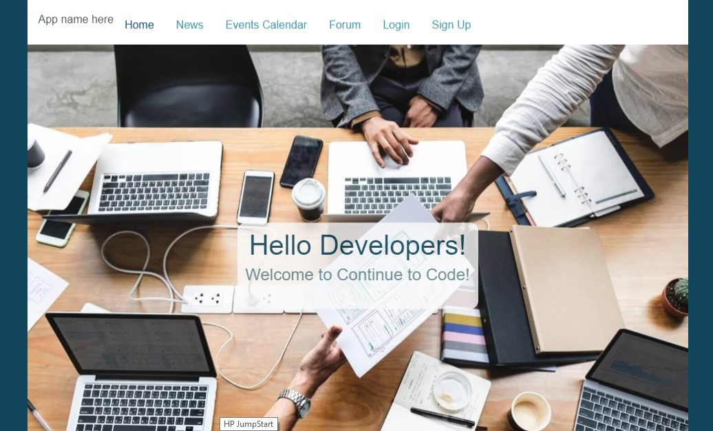

# NW Coders Loop - MERN Full Stack Application

This application is designed for graduates of coding bootcamp program to stay in touch and share relevant local events that can help graduates keep their skills and networks up to date. 

## How it works

The application consists of 2 main functions:

* Providing a forum for bootcamp graduates to post and save relevant trainings, workshops and resources that are tech-based and helpful.

* Using Mongo Scraper method on Meetup.com API, retrieving Chicago-area tech trainings and coding events and listing them on the app.

## Technologies

```
Axios
Bcrypt
Express
Mongo db
Mongoose
Morgan
Passport
React
* This project was bootstrapped with [Create React App](https://github.com/facebookincubator/create-react-app).
``` 

## Demo
```

```
View the live version of this app here:
[https://mern-passport.herokuapp.com/](https://mern-passport.herokuapp.com/)

## Project Structure
```
|-- server/
|  |-- server.js                            // The entry point for running the backend server locally, and main server for production
|  |-- passport/                             // Configuration files used to connect to different machines or set settings
|     |-- index.js                     // Overloads the passport object and defines 
|     
|  |-- db/                             
|     |-- index.js                  // Configures the connection to the database
|     |-- models/                   // represents data from our database, and defines schemas for each collection
|        |-- user.js                // Schema for the User collection
| -- src/                           // Entry for the React client side application
```

## Installation
```
To install this files contained in this git:
1. Copy the git files from this repository to clone locally
2. Initalize a local repository
3. Using node, install all dependencies listed above using 'npm install'
4. Configure the server > db > models > index.js files editing the Mongo URI to the path of your Mongo database
5. Configure the src > components > Calendar.jsx file to include group ID numbers of groups in a chosen area.  This information can be found at www.meetup.com/api
6.
7.
```


