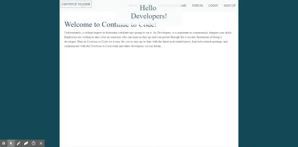

## Continue to Code
> Northwestern Coding Bootcamp Final Project 
> Mongo, Express, React, Node (MERN) + Passport.js authentication
> Deployed and hosted on Heroku

* Social Fourm - Discuss the latest news
* Event Calendar - View the current tech events taking place in Chicago
* News Browser - Read and Save current new articles

[View The Application](https://codingloopfrontend.herokuapp.com/).

## Demo

## Project Deplpyment

This application contians the Backend deployment files and a "dummy" Frontend for testing.
[The Frontend of this application is hosted on a sepreate repo] (https://codingloopfrontend.herokuapp.com/).

## Note
### Deployment Method for Local
* Clone repo and in terminal:
1) `npm run dev`

### Deployment Method for editing Heroku
* Clone Frontend and Backend repo and in terminal:
1) For Backend Repo `npm run server`
2) For Frontend Repo `npm run react`
